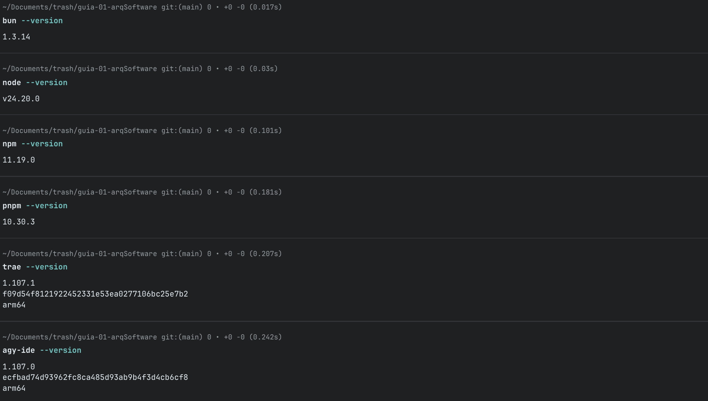
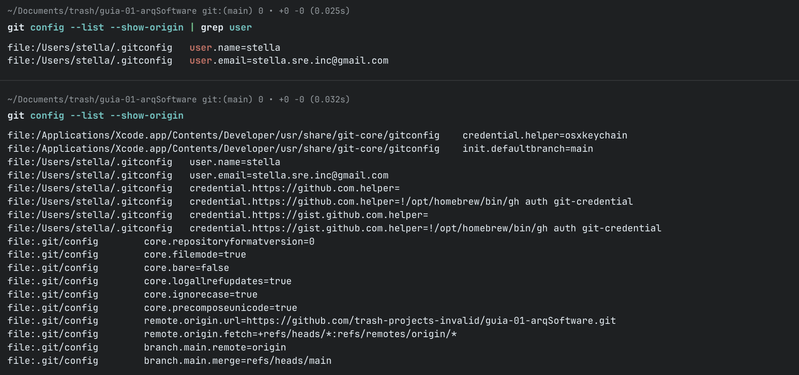

# IS488 - Arquitectura de Software

## Nombre completo del estudiante

isaias ramos lopez

## Descripción del curso

El curso de Arquitectura de Software (IS488) aborda los fundamentos de la
arquitectura de software: el rol del arquitecto, los estilos y patrones
arquitectónicos, los atributos de calidad y su documentación mediante
vistas y el modelo C4. Se estudian arquitecturas basadas en servicios
(REST y microservicios), así como seguridad, auditoría, control de
versiones, despliegue y administración de aplicaciones en ambientes
locales y en la nube. Integra teoría y laboratorio a través de un
proyecto incremental en el que se analiza, diseña, documenta, implementa
parcialmente y despliega una solución web, justificando las decisiones
arquitectónicas con criterios de calidad, mantenibilidad, escalabilidad,
seguridad e interoperabilidad.

## Expectativas del estudiante respecto al curso

- Comprender y aplicar estilos y patrones arquitectónicos (capas, MVC, microservicios, arquitectura hexagonal) en proyectos reales, tomando decisiones justificadas según los requisitos y atributos de calidad.
- Adquirir experiencia práctica en el diseño, documentación (modelo C4) y despliegue de soluciones web, incluyendo APIs REST, contenedores y pipelines de CI/CD en ambientes locales o en la nube.

## Nombre completo del docente

Ing. Lizbeth Jaico Quispe

## Evidencia de entorno

